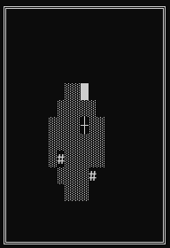

# Tile Wander 2
Put this project onto github for the purposes of archiving old projects. Made in 2018.


## Overview

Procedurally generated console turn based game. Kill enemies to collect better weapons and loot.



The purpose of this project was to learn C++ classes by remaking a console game that I [previously made](https://github.com/EvanGyori/TileWander) in C++ and to tidy up the game. Although, this version is incomplete.

Ignore the hundreds of warnings you get when compiling.

## Usage

Only works on windows.

Create a build directory and run cmake from the build directory
```
cmake <project-source-directory>
cmake --build .
```
Creates an executable called `TileWander2`.

WASD keys to move. Type in a key and press enter.
